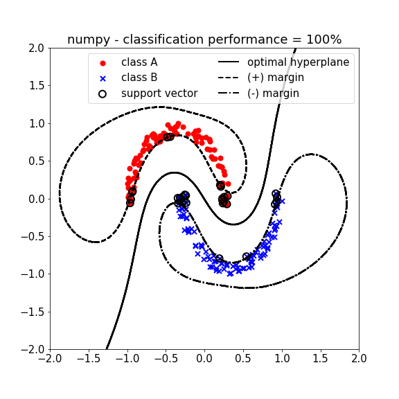
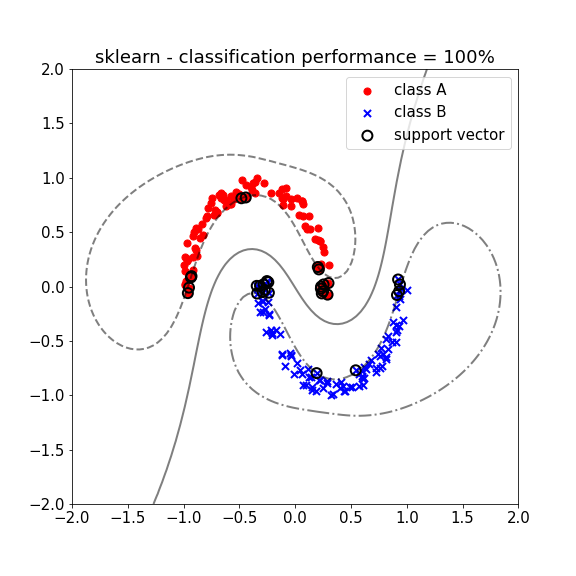

# Support vector machine (1964)

## Support vector machine for supervised machine learning

### Table of Contents

- [Images](#images)
- [Description](#description)
- [Keywords](#keywords)
- [How to Use](#how-to-use)
- [References](#references)
- [Author Info](#author-info)

## Images

## Description

"Support vector machine for supervised machine learning."

#### Technologies

- Python programming language

## Keywords

 - Supervised model
 - Classification
 - Support vectors
 - Lagrange dual
 - Optimal hyperplane
 - Radial basis function kernel
 - Linear kernel

## How to Use

#### Getting started

`git clone https://github.com/berberianareg/Support-vector-machine.git`

#### Dependencies

see requirements.txt

#### Installation

`pip install numpy`

`pip install matplotlib`

`pip install scipy`

`pip install -U scikit-learn`

#### Executing the program from command line

`python SVM.py`

## References

#### Links

- Relevant book - (https://www.amazon.com/Neural-Networks-Learning-Machines-3rd/dp/0131471392)
- Relevant video - (https://www.youtube.com/watch?v=_PwhiWxHK8o)

## Author Info

- Twitter - [@berberianareg](https://twitter.com/BerberianNareg)
- LinkedIn - [Nareg Berberian](https://www.linkedin.com/in/nareg-berberian-phd-ab6759b9/)

[Back to the Top](#support-vector-machine-1964)

